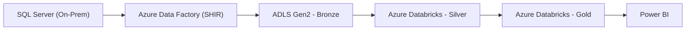

# Superstore Sales Lakehouse  


---

## 📖 Project Overview

Architected and implemented an Azure-based Lakehouse platform to ingest, transform, and model Superstore sales data from an on-prem SQL Server system into an analytics-ready star schema.

The solution modernizes manual reporting processes by introducing automated incremental pipelines, dimensional modeling, and governed cloud storage aligned with the Medallion Architecture (Bronze → Silver → Gold).

**Impact Delivered:**
- ~80% reduction in manual ETL work  
- Improved BI dashboard performance by ~40%  
- ≥99% pipeline execution reliability  
- Daily refreshed data available before 08:00 AM UTC  

---

## 🚀 Project Requirements

The solution was built to satisfy the following technical and operational requirements:

- Incremental ingestion from on-prem SQL Server  
- No direct load on transactional systems  
- <2-hour end-to-end processing SLA  
- Analytics-ready star schema for BI tools  
- Secure access through RBAC  
- Reproducible deployment via Bicep templates  
- Maintain historical context using SCD Type 2  

---

## 🏗️ Architecture

### High-Level Flow


### Architecture as Code – Mermaid



### Design Highlights

- Separation of compute (Databricks) and storage (ADLS)  
- Incremental watermark-based ingestion  
- Medallion architecture for structured data processing  
- Star schema for optimized BI consumption  
- Infrastructure as Code using Bicep  

---

## 🧱 Lakehouse Implementation

### 🥉 Bronze Layer – Raw Ingestion
- Parameterized ADF pipelines  
- Self-Hosted Integration Runtime for secure connectivity  
- Watermark-based incremental loading  
- Delta/Parquet storage partitioned by ingestion date  

### 🥈 Silver Layer – Standardized Data
- PySpark cleansing and validation  
- Data type harmonization  
- Deduplication and schema enforcement  
- Idempotent transformation logic  

### 🥇 Gold Layer – Analytics Model
- Kimball-style star schema  
- Surrogate key generation  
- SCD Type 2 implementation for historical tracking (e.g., Customer)  
- Date-based partitioning of fact tables for performance  

---

## 🧪 Data Quality Controls

To ensure reliability and consistency:

- Schema validation during Silver transformations  
- Null and duplicate checks on key business fields  
- Row count reconciliation between source → Bronze  
- Audit fields (batch_id, ingestion_timestamp) added for traceability  

---

## 🔎 Key Trade-offs & Decisions

- **Incremental vs Full Loads**  
  Chose incremental ingestion to reduce load time and avoid excessive compute usage.

- **Partition Strategy**  
  Daily partitioning selected to improve BI filtering performance without creating excessive small files.

- **Delta vs Raw Parquet**  
  Delta adopted in Silver/Gold for ACID compliance and schema enforcement.

- **SCD Type 2**  
  Used for dimensions where historical accuracy is required (e.g., customer attributes).

These decisions balanced complexity, performance, and maintainability.

---

## ⚙️ Technology Stack

| Layer | Technology |
|--------|------------|
| Ingestion | Azure Data Factory |
| Connectivity | Self-Hosted Integration Runtime |
| Storage | ADLS Gen2 (Delta/Parquet) |
| Processing | Azure Databricks (PySpark / Spark) |
| Modeling | Star Schema + SCD Type 2 |
| Infrastructure | Bicep (IaC) |
| Reporting | Power BI |

---

## ⚡ Performance & Governance

- Columnar Delta storage with partition pruning  
- Optimized Spark joins to reduce shuffle  
- Auto-scaling Databricks clusters  
- RBAC for access control  
- Encrypted storage (at rest + in transit)  
- Monitoring via ADF run logs and Databricks job history  

---

## 📂 Repository Structure

```
superstore-sales-lakehouse/
├── bicep/
├── adf/
├── databricks/
│   ├── bronze/
│   ├── silver/
│   └── gold/
└── README.md
```

---

## 🎯 Strategic Outcome

Delivered a scalable, maintainable Azure data platform that:

- Decouples analytics from transactional systems  
- Enables reliable daily BI reporting  
- Provides a structured, governed Lakehouse foundation  
- Supports future extensions into ML, forecasting, or advanced analytics  

---

## 🛡️ License

This project is licensed under the [MIT License](LICENSE). You are free to use, modify, and share this project with proper attribution.
