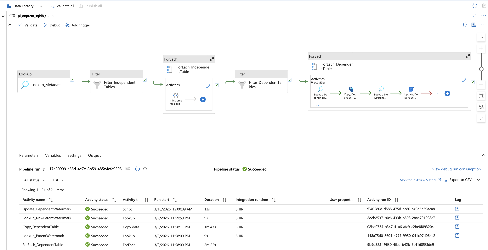
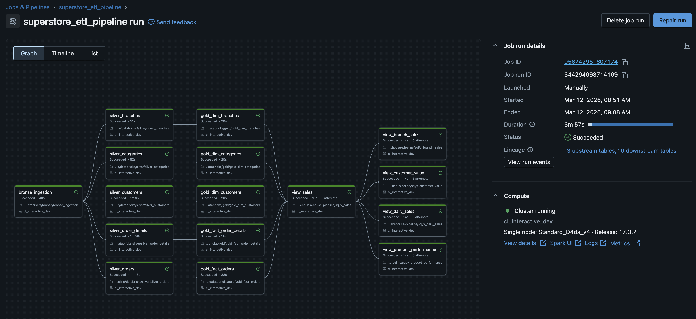

# Superstore Sales Lakehouse Pipeline


---

## 📑 Table of Contents

- Project Overview
- Source Dataset
- Business Impact
- Solution Architecture
- End-to-End Pipeline Flow
- Azure Data Factory Ingestion
- Databricks Job Orchestration
- Lakehouse Implementation
- Performance Optimizations
- Security & Governance
- Architecture Decisions
- Technology Stack
- Repository Structure
- License

---

## 📖 Project Overview

This project demonstrates the design and implementation of a **modern Azure Lakehouse data platform** that ingests retail sales data from an **on-premises SQL Server** system and transforms it into an **analytics-ready dimensional model**.

The platform implements the **Medallion Architecture (Bronze → Silver → Gold)** using:

- Azure Data Factory for ingestion  
- Azure Databricks for distributed transformations  
- Azure Data Lake Storage Gen2 for scalable storage  
- Delta Lake for optimized analytics workloads  

---

## 📊 Source Dataset

The source system is an **on-premises SQL Server database** containing transactional retail data for a large supermarket chain. The database stores operational data across multiple branches, products, customers, and sales transactions.

### Dataset Scale

| Entity | Volume |
|------|------|
| Superstore Branches | 161 |
| Product Catalog | 27,000 categorized items |
| Customers & Addresses | 99,998 |
| Orders | 10,235,193 |
| Order Details | 51,185,032 |

This dataset represents a **large-scale retail transactional workload with over 51 million product-level sales records**, making it suitable for demonstrating enterprise-grade data engineering patterns including incremental ingestion, distributed transformations, dimensional modelling, and optimized analytical storage.

The platform processes **51+ sales transactions generated from 10M orders across 161 retail branches**, showcasing scalable ingestion and transformation using **Azure Data Factory and Azure Databricks** within a modern Lakehouse architecture.

---

## 🎯 Business Impact

| Metric | Improvement |
|------|------|
| Manual ETL effort | ↓ ~80% |
| BI dashboard performance | ↑ ~40% |
| Pipeline reliability | ≥99% |
| Data availability | Daily refresh before **08:00 UTC** |

---

## 🧭 Solution Architecture


## 🔁 End-to-End Pipeline Flow

```
On-Prem SQL Server
        │
        ▼
Azure Data Factory
(Ingestion + Incremental Loads)
        │
        ▼
ADLS Gen2 Landing (Bronze)
        │
        ▼
Databricks Transformations
Bronze → Silver → Gold
        │
        ▼
Delta Lake Tables
        │
        ▼
Analytics Views
        │
        ▼
Power BI Dashboards
```

---

## 📥 Azure Data Factory Ingestion

Data ingestion from the on-premises SQL Server system is implemented using **Azure Data Factory (ADF)** pipelines.

ADF connects securely through a **Self-Hosted Integration Runtime (SHIR)** and loads data into **ADLS Gen2 landing storage**.

### Key Features

- Incremental ingestion using watermark logic  
- Secure on-prem connectivity via SHIR  
- Parameterized pipelines for reusable ingestion  
- Automated scheduled pipeline execution  

### Pipeline Snapshot



---

## 🔄 Databricks Job Orchestration

Data transformations are orchestrated using **Databricks Workflows**, which execute notebooks sequentially across the Medallion architecture layers.

```
Bronze Ingestion → Silver Transformations → Gold Modeling → Analytics Views
```

Each stage runs as a **task in a multi-task Databricks job**, enabling dependency management, monitoring, and reliable execution.

### Workflow Snapshot



---

## 🧱 Lakehouse Implementation

### 🥉 Bronze Layer – Raw Data

Purpose: ingest raw datasets with minimal transformation.

Notebook:

```
bronze/bronze_ingestion.ipynb
```

Responsibilities:

- Raw data ingestion  
- Metadata tracking  
- Schema preservation  
- Delta/Parquet storage  

---

### 🥈 Silver Layer – Cleaned Data

Purpose: standardize and validate raw datasets.

Transformations include:

- schema enforcement  
- data type harmonization  
- duplicate removal  
- null validation  

Notebooks:

```
silver/silver_branches.ipynb
silver/silver_categories.ipynb
silver/silver_customers.ipynb
silver/silver_orders.ipynb
silver/silver_order_details.ipynb
```

---

### 🥇 Gold Layer – Analytics Model

The Gold layer provides an **analytics-ready star schema** optimized for BI tools.

Dimension tables:

```
dim_customers
dim_categories
dim_branches
```

Fact tables:

```
fact_orders
fact_order_details
```

Key features:

- surrogate key generation  
- SCD Type 2 history tracking  
- partitioned fact tables  

---

## ⚡ Performance Optimizations

### Bronze Layer

- Auto-compaction to merge small ingestion files  
- Delta **OPTIMIZE** operations  
- Reshuffle during ingestion to balance partitions  

### Gold Layer

- **OPTIMIZE** for file compaction  
- **Z-ORDER indexing** to improve query performance  

Example:

```sql
OPTIMIZE gold.fact_orders
ZORDER BY (order_date, customer_id);
```

---

## 🔐 Security & Governance

Security practices implemented:

- Azure RBAC for role-based access control  
- Azure Key Vault for secret management  
- Encryption at rest and in transit  
- Separation of compute and storage  
- Pipeline monitoring via ADF logs  

---

## 🧠 Architecture Decisions

### Incremental Ingestion

Watermark-based incremental ingestion was chosen to:

- reduce load on the source system  
- minimize compute and transfer costs  
- speed up pipeline execution  

---

### Medallion Architecture

Bronze → Silver → Gold structure was implemented to:

- separate raw, cleaned, and analytical data  
- improve data lineage and debugging  
- support scalable transformations  

---

### Delta Lake Format

Delta Lake was selected for Silver and Gold layers due to:

- ACID transaction support  
- schema enforcement  
- improved analytical performance  

---

### Star Schema Modeling

Kimball-style star schema was implemented to:

- optimize BI performance  
- simplify analytical queries  
- improve data model clarity  

---

### Compute & Storage Separation

ADLS handles storage while Databricks handles compute.

Benefits:

- independent scaling  
- cost efficiency  
- improved architecture flexibility  

---

## ⚙️ Technology Stack

| Layer | Technology |
|------|------------|
| Ingestion | Azure Data Factory |
| Connectivity | Self-Hosted Integration Runtime |
| Storage | ADLS Gen2 |
| Processing | Azure Databricks |
| Data Format | Delta Lake |
| Modeling | Star Schema |
| Reporting | Power BI |

---

### 📂 Repository Structure

```
superstore-end-to-end-lakehouse-pipeline
├── adf
│   ├── dataset
│   │   ├── ds_parquet_adls_landing.json
│   │   └── ds_sqlserver_superstore.json
│   ├── factory
│   │   └── adf-superstore-dev.json
│   ├── integrationRuntime
│   │   └── SHIR.json
│   ├── linkedService
│   │   ├── ls_key_vault.json
│   │   ├── ls_parquet_adls_landing.json
│   │   └── ls_sql_server_onprem.json
│   ├── pipeline
│   │   └── pl_onprem_sqldb_to_adls.json
│   └── publish_config.json
│
├── databricks
│   ├── bronze
│   │   └── bronze_ingestion.ipynb
│   ├── silver
│   │   ├── silver_branches.ipynb
│   │   ├── silver_categories.ipynb
│   │   ├── silver_customers.ipynb
│   │   ├── silver_order_details.ipynb
│   │   └── silver_orders.ipynb
│   ├── gold
│   │   ├── gold_dim_branches.ipynb
│   │   ├── gold_dim_categories.ipynb
│   │   ├── gold_dim_customers.ipynb
│   │   ├── gold_fact_order_details.ipynb
│   │   └── gold_fact_orders.ipynb
│   ├── views
│   │   ├── v_branch_sales.ipynb
│   │   ├── v_customer_value.ipynb
│   │   ├── v_daily_sales.ipynb
│   │   ├── v_product_performance.ipynb
│   │   └── v_sales.ipynb
│   ├── jobs
│   │   ├── optimize_gold_tables.json
│   │   └── superstore_etl_pipeline.json
│   ├── optimize_gold_tables.ipynb
│   ├── config.ipynb
│   └── init_lakehouse.ipynb
│
├── docs
│   ├── architecture_overview.md
│   ├── data-architecture.png
│   ├── executive_summary.md
│   ├── naming_conventions.md
│   └── project_requirements.md
│
├── LICENSE
└── README.md
```

---

### 🎯 Strategic Outcome

Delivered a scalable, maintainable Azure data platform that:

- Decouples analytics from transactional systems  
- Enables reliable daily BI reporting  
- Provides a structured, governed Lakehouse foundation  
- Supports future extensions into ML, forecasting, or advanced analytics  

---

### 🛡️ License

This project is licensed under the [MIT License](LICENSE). You are free to use, modify, and share this project with proper attribution.
